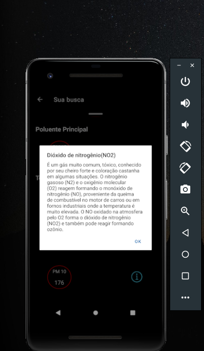
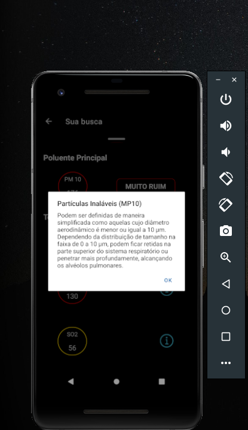
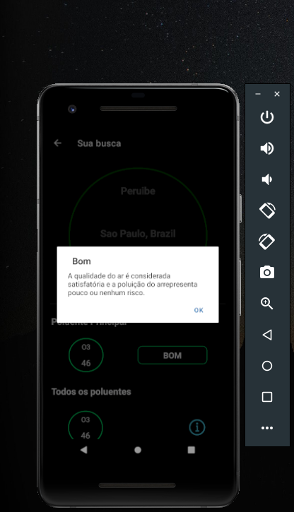
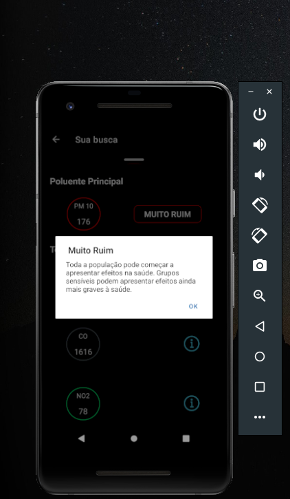
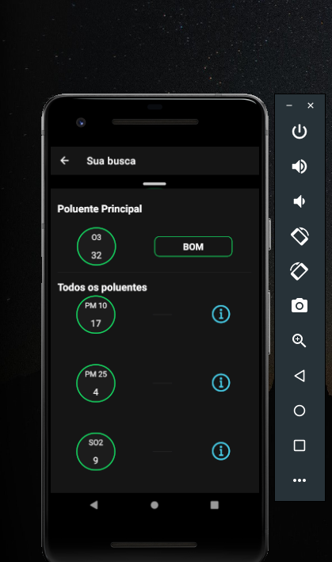
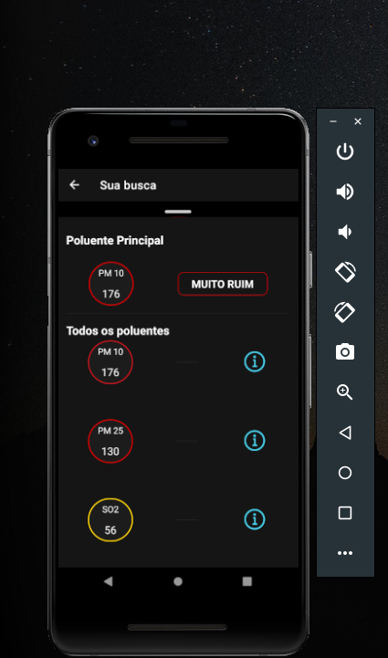
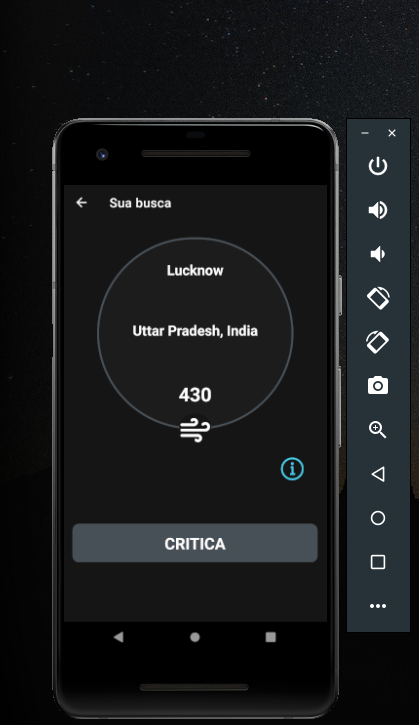

# Aplicação de Qualidade do Ar

**React Native App - Qualidade do Ar** using **Expo**, **Styled Components**, **Axios**

## Resumo

O app qualidade do ar, é uma aplicação que podemos realizar a busca de um determinado local, que nos informa o nível numérico e <br>o
status do ar como ( bom, moderado, ruim, muito ruim, critica ) em tempo real.

Os dados manipulados, são retornados da nossa requisição feita com o Axios, através da api: <link>' https://api.weatherapi.com/v1 '</link><br>

## Running

Clone the repository.

```bash
git clone https://github.com/ribeiro-le/App-qualidade-do-ar-React-Native.git

```

# Instalação Expo

Existem duas ferramentas que você precisa para desenvolver aplicativos com o Expo: um aplicativo de linha de comando<br> chamado Expo CLI para inicializar e servir seu projeto e um aplicativo cliente móvel chamado Expo Go<br> para abri-lo no iOS e Android. Qualquer navegador da web funcionará para abrir o projeto na web.

# 1.Expo CLI

Expo CLI é um aplicativo de linha de comando que é a principal interface entre um desenvolvedor e as ferramentas do Expo.<br> A Expo CLI também tem uma GUI baseada na web que aparece em seu navegador da web quando você inicia seu projeto -<br>você pode usar a GUI em vez da interface de linha de comando se ainda não estiver confortável em usar um terminal ou preferir GUIs,<br> ambas têm capacidades.

# Requisitos

> <a href="https://nodejs.org/en/"> Versão LTS do Node.js</a><br> > <a href="https://git-scm.com/"> Git</a><br> > <a href="https://facebook.github.io/watchman/docs/install#buildinstall">Watchman</a> - para usuários de macOS ou Linux

# Instalando o Expo CLI

```bash
# Install the comand line tools
npm install --global expo-cli

```

# 2. Aplicativo Expo Go para IOS e Android

A maneira mais rápida de começar a trabalhar é usar o aplicativo Expo Go em seu dispositivo iOS ou Android. O Expo Go permite que você<br> abra aplicativos que estão sendo servidos através do Expo CLI.

> <a href="https://play.google.com/store/apps/details?id=host.exp.exponent">Android Play Store</a> - Android Lollipop (5) e superior<br> ><a href="https://play.google.com/store/apps/details?id=host.exp.exponent">IOS App Store</a> - IOS 11 e superior<br><br>

# Criar um novo aplicativo

Neste ponto, devemos ter o Expo CLI instalado em nossa máquina de desenvolvimento e o aplicativo Expo Go<br> em um dispositivo físico ou emulador iOS ou Android. Caso contrário, volte ao guia de instalação antes de continuar.

# Inicializando o projeto

```bash
 # Create a project named my-app. Select the "blank" template when prompted

 expo init my-app

 # navigate to the project directory

 cd my-app

```

# Iniciando o servidor de desenvolvimento

```bash
expo start
```

Quando você executa expo start(ou npm start), o Expo CLI inicia o Metro Bundler, que é um servidor HTTP <br> que compila o código JavaScript do nosso aplicativo usando <a href="https://babeljs.io/">Babel </a> e o veicula no aplicativo Expo. Também aparece Expo Dev Tools, uma interface gráfica para Expo CLI.

# Abrindo o aplicativo em seu telefone/tablet

```bash
👨‍👩‍👧‍👧 Você pode abrir o projeto em vários dispositivos simultaneamente. Vá em frente e experimente em um telefone iPhone e Android ao mesmo tempo, se você tiver os dois à mão.

```

<ul> 
    <li>🍎 No seu iPhone ou iPad, abra o aplicativo padrão "Câmera" da Apple e escaneie o código QR que você vê no terminal ou no Expo Dev Tools.</li><br>
    <li>🤖 No seu dispositivo Android, pressione "Scan QR Code" na aba "Projects" do app Expo Go e escaneie o QR code que você vê no terminal ou no Expo Dev Tools. </li>
</ul><br>

Quando o aplicativo Expo Go terminar de instalar, abra-o. Se você criou uma conta com expo-cli, então você pode entrar aqui na guia "Perfil".<br> Isso facilitará a abertura de projetos no cliente quando você os tiver aberto em desenvolvimento — eles aparecerão automaticamente na guia "Projetos" do aplicativo cliente.<br>

👉 Muitas vezes, é útil poder executar seu aplicativo diretamente em seu computador em vez de em um dispositivo físico separado.<br> Se desejar configurar isso, você pode saber mais sobre como <a href="https://docs.expo.dev/workflow/ios-simulator/">Instalar o IOS Simulator(somente macOS)</a> e <a href="https://docs.expo.dev/workflow/android-studio-emulator/">instalar um emulador do Android. </a><br><br>

# Install Styled Components<br>

Styled Components é uma solução CSS-in-JS que permite criar componentes React com um determinado estilo com muita facilidade.<br> Usando styled-components com o Expo, você pode criar estilos universais que funcionarão da mesma forma na Web, em dispositivos móveis e em computadores!<br>

Use styled-components/native em vez de styled-components:

```bash
import React from 'react';
import styled from 'styled-components/native';

const Container = styled.View`
  flex: 1;
  background-color: #fff;
  align-items: center;
  justify-content: center;
`;
const Title = styled.Text`
  color: #000;
  text-align: center;
  font-size: 16px;
`;
export default () => (
  <Container>
    <Title>Hello</Title>
  </Container>
);
```

```bash
expo  install  styled-components
```

# Install Axios <br>

Axios é um dos clientes HTTP mais fáceis de aprender e usar. Fazer uma solicitação de API é tão simples quanto passar um objeto de configuração<br> para o Axios ou invocar o método apropriado com os argumentos necessários. Você aprenderá o básico do Axios nesta seção

```bash
expo install axios
```

```bash
import axios from 'axios';


const api = axios.create({
    baseURL: 'https://api.weatherapi.com/v1'
})

export default api;
```

## Final Result

## Informação dos poluentes

<br>




<br>
<br>

## Status dos poluentes

<br>




<br>
<br>

## Listando poluentes no modal




<br>
<br>

## Exibindo local





<br>
<br>
